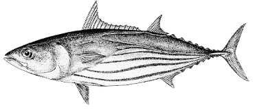
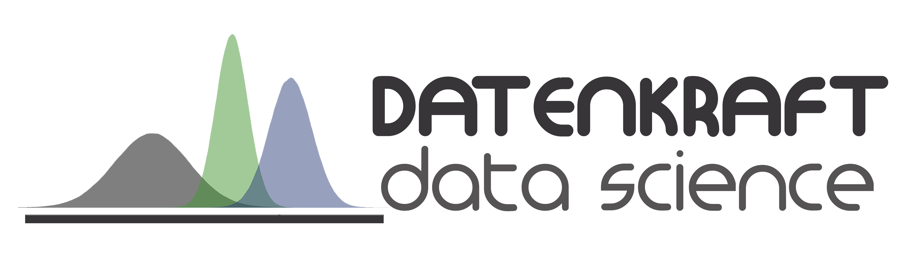

## About this Shiny App `Application developed to present the results of the Assessment of Management Measures developed for the western stock of Atlantic skipjack tuna`

<center>
<BR />

</center>
<BR />

## Running this application in R...

To run this application locally on your computer, simply execute
the following commands in the **R** console.

```{r} 
 install.packages(c("shiny", "shinydashboard", "ggplot2", "grid", 
                    "markdown", "ggExtra", "leaflet", "plotly", "DT", "viridis"), 
                    dependencies = TRUE)
 shiny::runGitHub("SKJW_MSE_Shiny", "rodrigosantana")
```

## Licence for this *software*

Licence Creative Commons 4.0

<a href="https://creativecommons.org/licenses/by-nc-nd/4.0/">

</a>
<BR />

## Authors

Rodrigo Sant'Ana    | rsantana@univali.br  
Bruno Mourato       | bruno.mourato@unifesp.br  

A product developed by 
<a href="http://www.datenkraft.com.br">

</a>
<BR /><BR />

Product for exclusive use of
<a href="https://iccat.int/">

</a>
<BR />

## Credits

This application was entirely developed with
[shiny](http://shiny.rstudio.com/) within the statistical computational environment [R](http://www.r-project.org/).