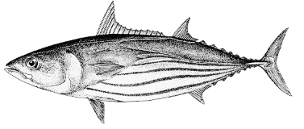

 

 

<H1>
Application developed to present the results of the Assessment of Management Measures developed for the western stock of Atlantic skipjack tuna
</H1>

 

 

## Introduction...

The SCRS’s Tropical Tunas Species Group has been developing a management strategy evaluation (MSE) framework for West Atlantic skipjack (SKJ-W) since 2020. In 2015, the Commission called for adoption of a management procedure (MP) for SKJ-W and seven other priority stocks based on an MSE ([Rec. 15-07](https://www.iccat.int/Documents/Recs/compendiopdf-e/2015-07-e.pdf)). This call for an MSE has been echoed in every ICCAT tropical tunas measure since 2016, with [Rec. 16-01](https://www.iccat.int/Documents/Recs/compendiopdf-e/2016-01-e.pdf) setting initial performance indicators for tropical tunas. While the East Atlantic skipjack stock is included in the multispecies MSE with bigeye and yellowfin tunas, western Atlantic skipjack has been earmarked for its own MSE since the Commission adopted the [First Draft Roadmap for the Development of MSE and Harvest Control Rules (HCR)](https://www.iccat.int/com2016/DocENG/PLE_137B_ENG.pdf) in 2016; this is because western skipjack tuna are caught predominantly in a single-stock fishery.

External experts launched the MSE work in 2020 [(SCRS/140/2020)](https://www.iccat.int/Documents/CVSP/CV077_2020/n_8/CV077080121.pdf) and since then, MSE development has been conducted by the SCRS ([SCRS/2022/097](https://www.iccat.int/Documents/CVSP/CV079_2022/n_1/CV079010384.pdf), [SCRS/2022/180](https://www.iccat.int/Documents/CVSP/CV079_2022/n_1/CV079010851.pdf), [SCRS/2023/169](https://iccat.int/Documents/CVSP/CV080_2023/n_2/CV080020260.pdf), [SCRS/2024/050](https://iccat.int/Documents/CVSP/CV081_2024/n_2/CV08102050.pdf), [SCRS/2024/162](https://iccat.int/Documents/CVSP/CV081_2024/n_2/CV08102162.pdf), [SCRS/2025/087](https://iccat.int/Documents/CVSP/CV082_2025/n_5/CV082050087.pdf), [SCRS/2025/157](https://iccat.int/Documents/CVSP/CV082_2025/n_5/CV082050157.pdf), SCRS/2025/228). The Commission adopted conceptual management objectives for SKJ-W in 2022 ([Res. 22-02](https://www.iccat.int/Documents/Recs/compendiopdf-e/2022-02-e.pdf)) and operationalized them in 2024 ([Rec. 24-04](https://iccat.int/Documents/Recs/compendiopdf-e/2024-04-e.pdf)). Recommendation 24-04 also set a 3-year management cycle and an implementation schedule for the MP and called for final tuning of candidate MPs in 2025.

The MSE work is now complete and ready for ICCAT to adopt an MP in 2025, in accordance with Rec. 24-04 and the Commission’s workplan [Revised Roadmap for the ICCAT MSE processes adopted by the Commission in 2024](https://www.iccat.int/mse/Docs/MSE_Roadmap_ENG.pdf).

